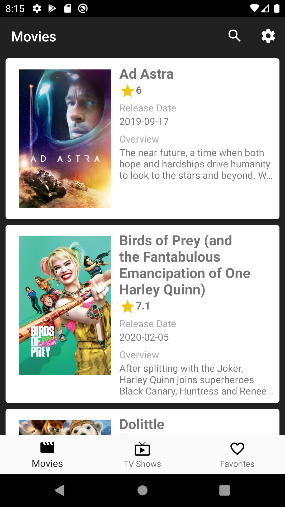
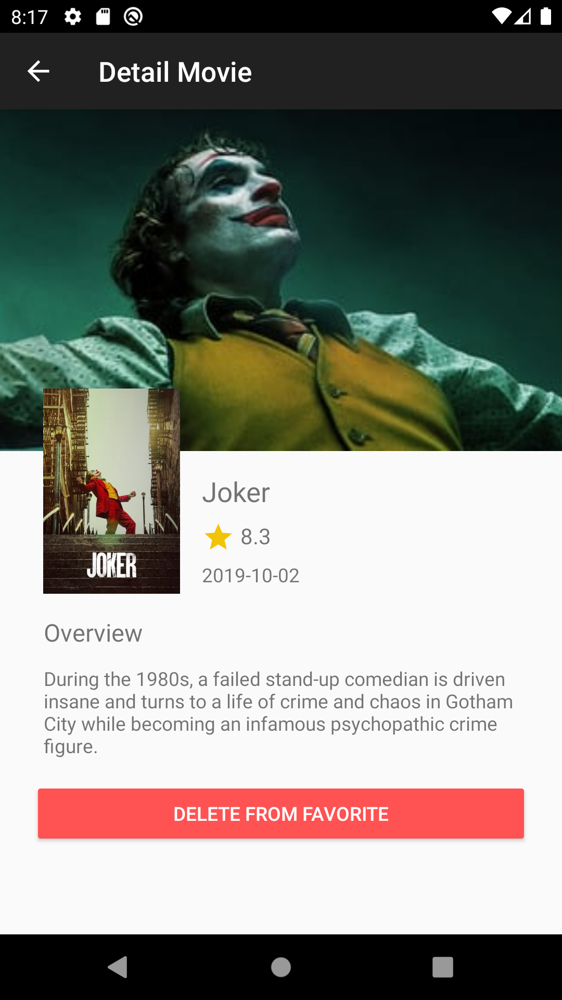
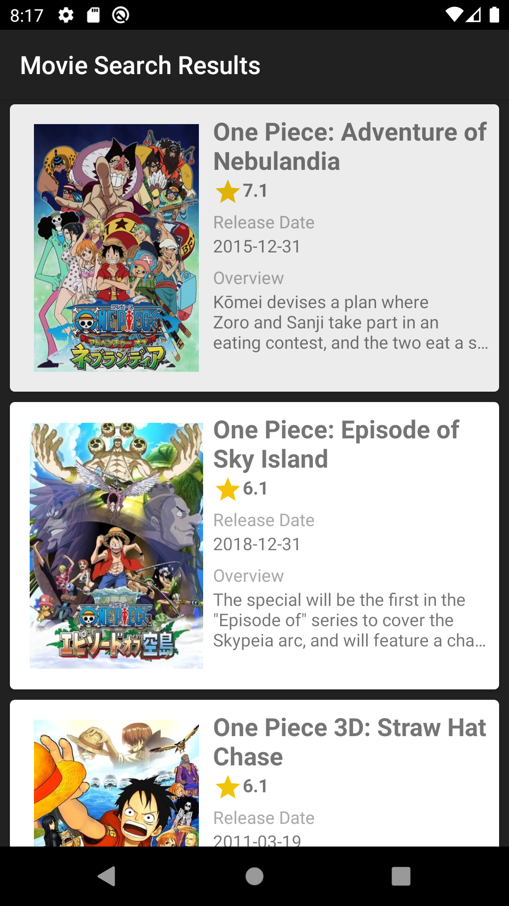

## Ini adalah source code Final Project pada kelas Belajar Fundamental Aplikasi Android pada situs Dicoding

Aplikasi Katalog film yang menampilkan daftar film dan juga tayangan TV. Terdapat fitur pencarian, alarm, dan menambahkan item ke daftar favorit.

Screenshot:

1. Daftar Film

2. Detail Film

3. Hasil Pencarian

